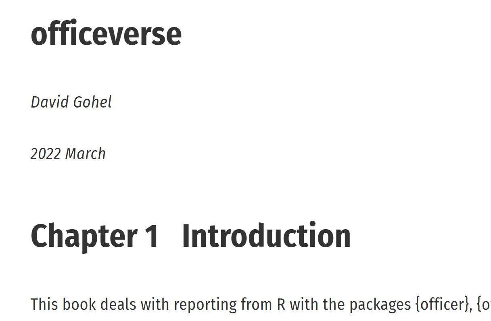
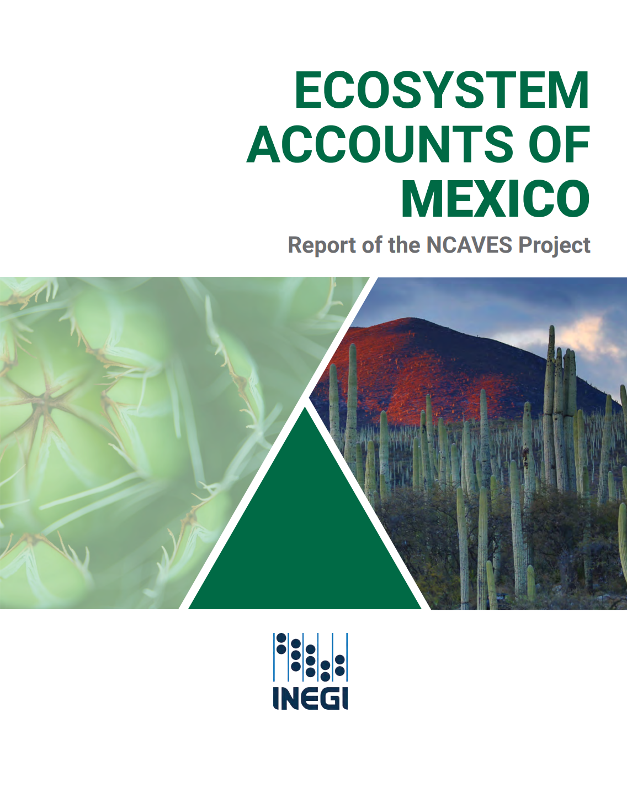

```{r setup, include=FALSE}
knitr::opts_chunk$set(echo = FALSE)
```

```{r, echo = FALSE, fig.align = 'center', out.width = '30%'}

knitr::include_graphics("robots-judea-pearl-IA.jpg")
```


|Documento | Vínculo |
|---------|---------|
|{width=40%}|[El Libro del Porqué](http://www.filosofiadebolsillo.com/el-libro-del-porque-la-nueva-ciencia-de-la-causa-y-el-efecto-de-judea-pearl/)|
|{width=40%}|[Reproducible Analytical Pipelines](http://dataingovernment.blog.gov.uk/2017/03/27/reproducible-analytical-pipeline/)|
|{width=40%}|[Office verse](http://ardata-fr.github.io/officeverse/)|
|{width=40%}|[Página SEEA EA](http://seea.un.org/ecosystem-accounting)|
|{width=40%}|[Página SEEA EA - NCAVES-Mexico](http://seea.un.org/content/mexico-0)|
|{width=40%}|[Reporte SEEA EA NCAVES-México](http://seea.un.org/sites/seea.un.org/files/images/Mexico/ncaves_-_mexico_-_country_report_-_final.pdf)|
|{width=40%}|[Reporte INEGI NCAVES](https://www.inegi.org.mx/contenidos/investigacion/cem/doc/docNCAVES.pdf)|

