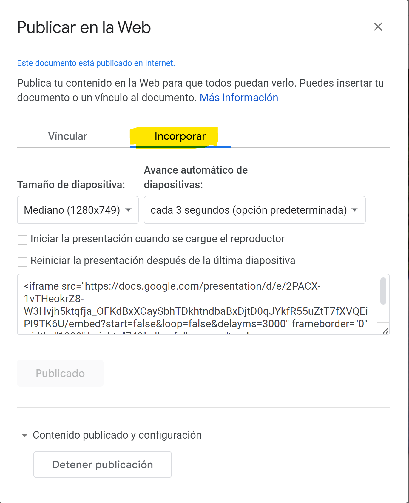

## Presentación incrustada

Utilizar el código *iframe* con la especificación de **MS-SharePoint** funciona, pero exige autenticación antes de desplegar la presentación. No he encontrado la forma de hacer *pública* la presentación. En el caso de **Google-slides** sí hay la opción de hacer pública la presentación y también se ofrece la opción de generar el vínculo *iframe* para incrustar. Este camino funciona bastante bien. Es el que se ejemplifica a continuación.

Para hacer esto sólo subi la presentación *PPT* en **Google-slides**. Utilicé la opción del menú *Archivo/publicar en la web*

{width=60%} 

Finalmete seleccioné el vínculo de incrustación.

{width=40%} 

Lo que sigue es el vínculo copiado de esta ventana. Agreguué la instrucción `data-external="1"` al final del tag iframe, aunque no parece ser realmente necesaria.

<iframe src="https://docs.google.com/presentation/d/e/2PACX-1vTHeokrZ8-W3Hvjh5ktqfja_OFKdBxXCaySbhTDkhtndbaBxDjtD0qJYkfR55uZtT7fXVQEiPI9TK6U/embed?start=false&loop=false&delayms=3000" frameborder="0" width="1280" height="749" allowfullscreen="true" mozallowfullscreen="true" webkitallowfullscreen="true" data-external="1"></iframe>

