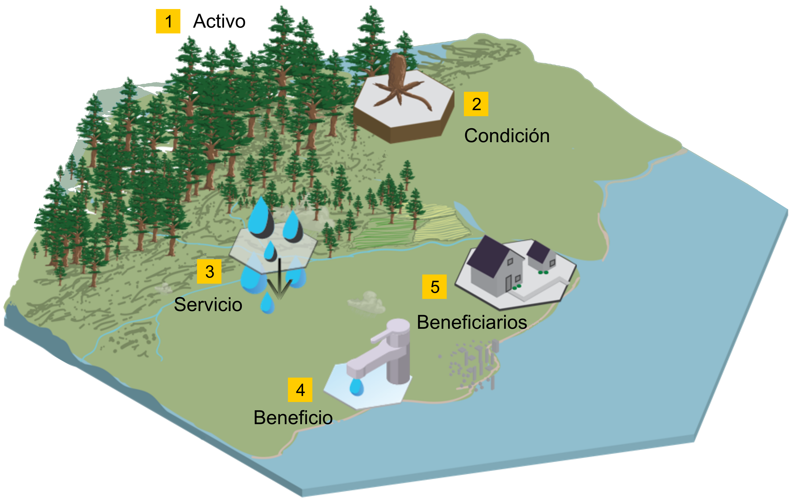

```{r, echo = FALSE, fig.align = 'center', out.width = '30%'}


```


```{r setup, include=FALSE}
knitr::opts_chunk$set(echo = FALSE)
```

En esta presentación buscamos compartir estructura conceptual y las definiciones operativas de los elementos que intervienen la integración de un sistema de contabilidad ambiental y económica basado en ecosistemas ([SCAE CE](https://seea.un.org/ecosystem-accounting), SEEA EA en inglés). El objetivo que proponemos para esta participación es:

> El participante identifica los conceptos clave de la tipología SCAE EA y conoce la forma como se aplicó el enfoque en el piloto mexicano


Lo que sigue es el vínculo a la presentación que usaremos para discutir el tema.


<iframe src="https://docs.google.com/presentation/d/e/2PACX-1vQZDkp3qiOVeGb9kPrC9jS4-9xL1JY2j9c0xMKkil_cR64v8rE1DUgKRBL4c0QMyA/embed?start=false&loop=false&delayms=3000" frameborder="0" width="1280" height="435" allowfullscreen="true" mozallowfullscreen="true" webkitallowfullscreen="true"></iframe>


