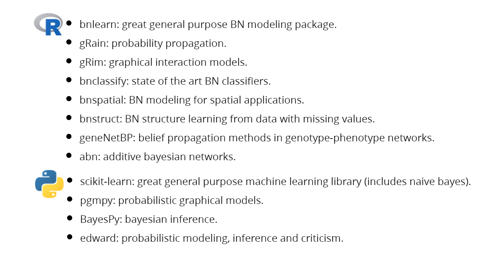
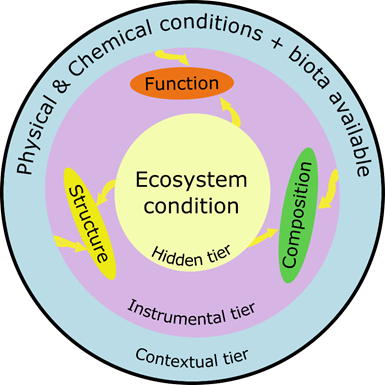
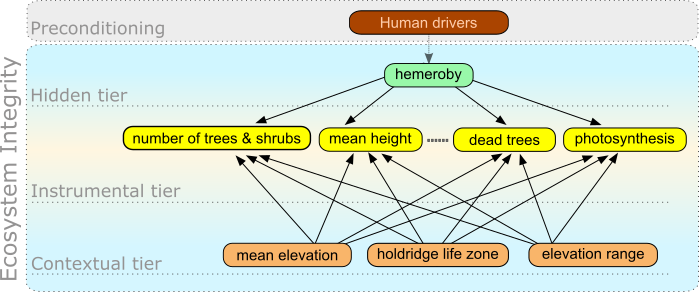
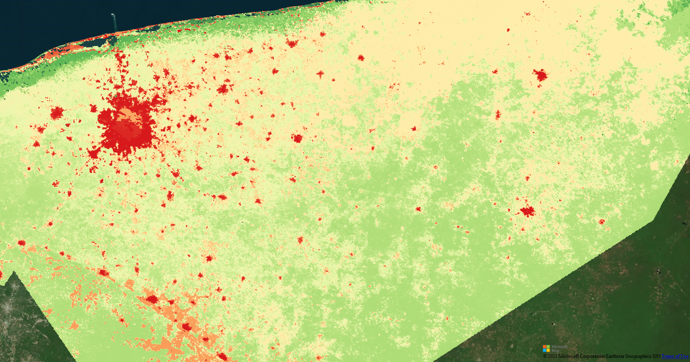
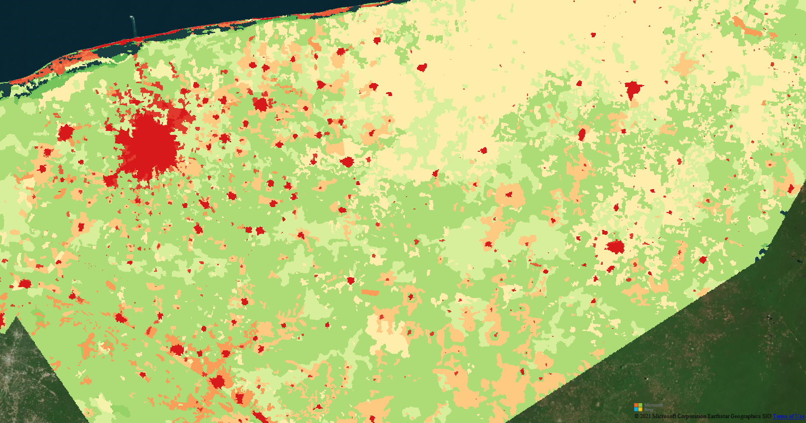

# Aprendizaje de máquina (Machine learning)

The probabilistic graphical models ecosystems are quite large these days.Arguably a bit more developed in R than in python. 


```{r, echo = FALSE, fig.align = 'center', out.width = '100%' }


```

Probabilistic graphical models and bayesian causal inference in general has (unfortunately?) also been very successful in the propriety software department. There are many commercial applications that have impressive tools and even great educational resources (for a price):

* [Netica](https://www.norsys.com/netica.html), used by us. Conabio has licenses for the application and c++ api.
* [BayesFusion](https://www.bayesfusion.com/)
* [BayesiaLab](https://www.bayesia.com/)

Here we will be focusing on the excellent bnlearn package. 

# Defining BNs

In general, there are many ways to define BNs. It should be noted that what is usually needed first is a set of variables (which will later correspond to nodes) and a graph structure (some format where you can infer which nodes are connected to which).

The first natural step is to just have a list of the nodes we will work with. In bnlearn this is done quite easily. For example:

```{r, echo = TRUE, fig.align = 'center'}

library("bnlearn")

empty_graph <- empty.graph(c("X", "Y", "Z"))

empty_graph

```

Which simply initializes a 3-node BN with no arcs. We can then just set some arcs with a a two column matrix: "from" -> "to".

```{r, echo = TRUE, fig.align = 'center'}

edges = matrix(c("X", "Y",
                 "Z", "Y"),
                 ncol=2, byrow=TRUE)

arcs(empty_graph)=edges

empty_graph

```


```{r, echo = FALSE, fig.align = 'center', out.width = '100%' }

knitr::include_graphics("2_empty.png")
```

## Notes on data availability for EI modelling

The question of what data to use to model EI is an open one. We have already mentioned that we have a supervised approach (our target node has EI labels) and that the input for our models is a pixel*variables matrix. Since our objective is to produce a spatially explicit index each column in our input data table corresponds to a flattened geo-raster image. It's then extremely important to bare in mind that any variable can be used for EI modelling as long as it can be put in raster format. All rasters must be harmonized meaning that their extent, spatial resolution and projection be the same.

All our variables are already harmonized and can be found [here](https://www.dropbox.com/sh/xvhlh4kq5pr4nam/AADzqY97zgy1p1vvwg40xLNEa?dl=0) and all the used code can be found in [this](https://github.com/jequihua/ei-workshop) repository.

Before we begin to use them, we should mention that there are three main approaches to definine a BN structure:

* Expert knowledge
* Automated structure learning (algorithms)
* Combinations of the previous

we followed a combination of expert knowledge and structure learning to propose our EI-BN structure. It's based on a conceptual model which relates three distinct levels (tiers) of ecosystem functioning.

```{r, echo = FALSE, fig.align = 'center', out.width = '100%', fig.cap="\\ The ecosystem integrity three-tier model."}


```

Even though we are currently working with 25 variables (TOO MANY!!!), the gist of the BN structure is something like:

```{r, echo = FALSE, fig.align = 'center', out.width = '100%', fig.cap="\\ A generic ecosystem integrity BN based on the three-tier model."}


```

## Defining a BN with our variables

We have created code that allows to directly initilize a BN by reading in the list of (harmonized) rasters in a given folder as well a supplying the name of the target variable (EI).


```{r, echo = TRUE, fig.align = 'center'}

# load packages
library("tools")

# load misc functions
source("./R/misc_functions.R")

# List of independent variable rasters file names
indep_var_paths = list_files_with_exts("./indep_var_paths/",
                                       exts = "tif",
                                       full.names = FALSE)

# File name of dependent variable raster to be used
dep_var_file = "hemerobia_250m.tif"

adj_matrix = data.frame(matrix(0,length(indep_var_paths)+1,
                                 length(indep_var_paths)+1))

# set column and row names as file names 
# (dependent and independent variables)
colnames(adj_matrix)=c(dep_var_file,indep_var_paths)
rownames(adj_matrix)=c(dep_var_file,indep_var_paths)

# Remove file extensions from dimension names
# Replace "." and spaces with "_"
adj_matrix = fixDimnames(adj_matrix)

# write initialized adjacency matrix to disk
write.table(adj_matrix,"ienet_adj_v2.csv",sep=",",
            row.names=TRUE,col.names=NA)

```

The output is an empty matrix where the rows and columns correspond to the available variables. This can be uploaded to google docs to discuss with experts which nodes should be connected. This can be a very cumbersome task but luckily we have [already](https://docs.google.com/spreadsheets/d/1TaI-yqTMK1ymKu_Ca6U77noY39wQW_PqSRwTrVeFvYc/edit?usp=sharing) done it for you. 


```{r, echo = FALSE, fig.align = 'center', out.width = '100%', fig.cap="\\ The ecosystem integrity adjacency matrix."}

knitr::include_graphics("./5_adj_matrix.png")
```

# Fitting the EI-BN

Now that we have our variable list and our structure its time to fit our bayesian network. As mentionded first we need to have our data in table format. This will be produced by reading in our geo-rasters and flattening them to accomodate a single column in a data table. 

```{r, echo = TRUE, fig.align = 'center'}

# load additional packages
library("raster")
library("gRain")

# List of independent variable rasters.
indep_var_paths = list_files_with_exts("./indep_var_paths/",
                                  exts = "tif")

# Load dependent variable raster (will be used as base raster).
dep_var_path = "./delta_vp/hemerobia_250m.tif"

# Create raster brick where bands are [dep_var,indep_var_1,...,indep_var_n].
bnbrik = bnBrick(dep_var_path,indep_var_paths)

# To df and drop incomplete rows
bnbrik_df = data.frame(rasterToPoints(bnbrik))
bnbrik_df = bnbrik_df[complete.cases(bnbrik_df),]

# User must know which variables are factors and coerce them to factor.
bnbrik_df = factorCols(bnbrik_df,
                       c("hemerobia_250m", "zvh_31_lcc_h"))

```

We are working with discrete bayesian networks. So all nodes must be categorical. It's a research topic in itself how to discretize continuous variables in order to maximize the information they contain. To avoid complications in the original EI-BN we simply discretized all continuous variables using 10-equal intervals. We will do the same here but using 5 to lower the overall computation time. 

It should also be noted that the names of the variables that need discretizing must be supplied, but we know here that they are simply the 3rd to 24th variables/columns. 

```{r, echo = TRUE, fig.align = 'center'}

names(bnbrik_df)

# User must know which variables are numeric and discretize them.
bnbrik_df = discretizeCols(bnbrik_df,
                           names(bnbrik_df)[3:24])
```

Now we load the csv file that has our adjacency matrix. This is then assigned to a bnlearn network object.  

```{r, echo = TRUE, fig.align = 'center'}

# Load adjacency matrix from csv.
ie_adj <- read.csv("./networks/ienet_v2.csv", header = TRUE, row.names = 1, stringsAsFactors = FALSE)
ie_adj[is.na(ie_adj)] <- 0

# Create a graph based on this adjacency matrix.
ie_graph = empty.graph(rownames(ie_adj))
amat(ie_graph) = as.matrix(ie_adj)


ie_graph

```

We are now ready to fit the EI-BN, this is actually quite fast!!! [sadly unlike predicting with it].

```{r,eval=FALSE, echo = TRUE, fig.align = 'center'}

# Fit bayesian network.
fitted = bn.fit(ie_graph, bnbrik_df[,3:25], method = "bayes")

# We use the junction tree algorithm to create 
# an independence network that we can query
# will be used later to predict and create the EI map.
prior <- compile(as.grain(fitted))

```

# Predicting an EI index with the EI-BN.

Now that we have our fitted EI-BN we simply need to predict over the whole data set.

It's a good time to dwell a bit more deeply into the nature of our evidence for ecosystem condition. 

In order to prime the hidden tier we prepared a “Delta Primary Vegetation” (DeltaPV) map, based on the [hemeroby concept](https://www.sciencedirect.com/science/article/abs/pii/S1617138104000299), that estimates the amount of transformation that vegetation shows by comparing [current](https://www.inegi.org.mx/temas/usosuelo/) land cover obtained from classified satellite imagery of the year 2008 versus [expected](https://www.inegi.org.mx/temas/bosques/) “primary vegetation”, as judged by expert opinion. The qualitative amount of change was evaluated following the criteria showed in Figure 4.


```{r, echo = FALSE, fig.align = 'center', out.width = '100%', fig.cap="\\ Description of our proposed hemeroby/deltavp levels."}

knitr::include_graphics("./6_deltavp.png")
```

As a classification task this will give us a probability for each of the 19 degradation levels (0-pristine, 18-well conserved) we have at our disposal as evidence for each and every pixel of our region of interest (the whole of Mexico but in this particular case it's state of Yucatan).

We then proceed to use these probabilities to calculate the expectancy of the degradation levels and then standardize this over all the pixels (to 0-degraded, 1-well conserved). This is used to create the EI index map.

```{r,eval=FALSE, echo = TRUE, fig.align = 'center', eval=FALSE}

# Prediction (takes a million years but can be trivially parallelized, TODO)
prediction = predict(prior,
                     response="hemerobia_250m",
                     newdata=bnbrik_df,
                     type="distribution")


probabilities <- prediction$pred$Adelt_vp_250m

ie_expectancy <- list()
for (i in 1:nrow(probabilities)){
  print(i)
  expect <- sum(as.numeric(colnames(probabilities)) * probabilities[i,])
  print(expect)
  ie_expectancy[[i]] <- expect
}

ie <- unlist(ie_expectancy)
ie <- (18-ie)/(18)

final_raster = data.frame(ie=ie,x=bnbrik_df$x,y=bnbrik_df$y)
coordinates(final_raster)=~x+y
gridded(final_raster)=TRUE
final_raster = raster(final_raster)
projection(final_raster)=projection(bnbrik)

# save raster
rf <- writeRaster(final_raster, filename="ie_yucatan.tif",
                  format="GTiff", overwrite=TRUE)

```

```{r, echo = FALSE, fig.align = 'center', out.width = '100%'}


```

```{r, echo = FALSE, fig.align = 'center', out.width = '100%', fig.cap="\\ Comparison of deltavp/hemerobia and the EI index."}


```

