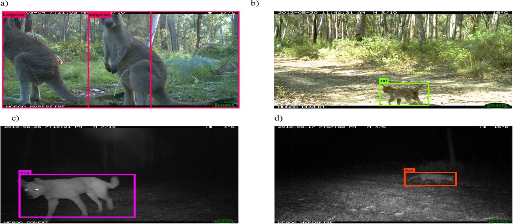

# Aprendizaje de máquina (Machine learning)

Métodos computacionales para aprender de datos con el fin de replicar una tarea o toma de decisión.

Existen varios paradigmas en aprendizaje de máquina, con distintos objetivos:

* El aprendizaje supervisado procura predecir o estimar una variable respuesta a partir de datos de entrada
* El apprendizaje no supervisado procura describir estructuras interesantes en datos, donde no necesariamente hay una respuesta que predecir
* El aprendizaje semi-supervisado procura utilizar datos asociados a una variable respuesta al mismo tiempo que datos sin la variable para procurar mejor estimarla. Estos es intenta explotar datos sin etiquetas para mejorar la estimación.
* El aprendizaje por refuerzo intenta estimar la mejor política posible en un problema de toma de decisiones secuenciales.

Ejemplos de tareas de aprendizaje:

* Predecir si un individuo va a sobrevivir el hundimiento del Titanic,
* Detectar llamados de murciélagos en grabaciones ultrasónicas,
* Clasificar especies de animales en imágenes digitales producidas a través de foto trampeo,
* Estimar el ingreso mensual de un hogar a partir de las características de la vivienda,
* Dividir a los clientes de Netflix según sus gustos.
* Recomendar artículos a clientes de un programa de lealtad o servicio online.

<span style="color:red"> Ejercicio 1: De los ejemplos anteriores, cuáles consideran que corresponden a aprendizaje supervisado, cuáles a aprendizaje no supervisado y cuáles se podrían resolver con ambos?</span>

Las razones usuales para intentar resolver estos problemas computacionalmente son diversas:

Quisiéramos obtener una respuesta barata, rápida, automatizada, y con suficiente exactitud y precisión. Por ejemplo, reconocer caracteres en una placa de coche de una fotografía se puede hacer por personas, pero eso es lento y costoso. 

```{r, echo = FALSE, fig.align = 'center', out.width = '80%'}

knitr::include_graphics("1_license.jpeg")
```

Igual ver cada fotografía para detectar e identificar los animales ahí presentes toma muchísimo tiempo.

```{r, echo = FALSE, fig.align = 'center', out.width = '80%'}


```

Quisiéramos superar el desempeño actual de los expertos o de reglas simples utilizando datos: por ejemplo, en la decisión de dar o no un préstamo a un solicitante, puede ser posible tomar mejores decisiones con algoritmos que con evaluaciones personales o con reglas simples que toman en cuenta el ingreso mensual, por ejemplo.

¿Lo mismo para la mejor toma de decisiones en cuanto al manejo de recursos naturales?

También es de gran interés entender de manera más completa y sistemática el comportamiento de un fenómeno, identificando variables o patrones importantes.

¿Dado un conjunto de datos ecológicos podemos hacer generar modelos que nos permitan ir explorando distintos aspectos de la integridad ecosistémica para generar conocimiento?

De una vez adelantamos que el acercamiento que se sigue para generar el índice de integridad
propuesto es uno de aprendizaje supervisado. Existe una variable que sirve de evidencia para el nivel de condición de los distintos ecosistemas del país y a la par se tienen variables que permiten estimar y, eventualmente, explicar este nivel de condición. El único detalle importante aquí es que la evidencia es categórica, y el índice deseado es uno continuo entre 0 y 1. 

El aprendizaje de máquina generalmente se lleva a cabo con ayuda de software especializado. Programas propietarios o de código abierto o comunmente utilizando lenguajes de programación. Por ejemplo R, python y Julia. 

Recomendamos ampliamente aprender los tres en la medida de lo posible pues ofrecen distintas posibilidades y ventajas. En esta sesión trabajaremos con R.

# Manejo de datos y modelado en R

Para comenzar carguemos unos datos ejemplo al espacio de trabajo de R.

```{r, echo = TRUE, fig.align = 'center'}

# Cargar paquetes.
library("raster")

# Cargar un geotiff a R, de hecho el que sirve como evidencia para el modelo de IE.
ruta_evidencia <- "../../../data/delta_vp/hemerobia_250m.tif"
raster_evidencia <- raster(ruta_evidencia)

raster_evidencia

```

Para aquellos que no han experimentado con lenguajes de programación para manejo y análisis de datos, acá están pasando varias cosas. Repasamos algunas de ellas.

Primero que nada, un elemento fundamental que debemos mencionar es el de una función. Una función recibe argumentos y lleva a cabo una cierta tarea (aunque suene un poco raro también puede recibir ningún argumento y llevar a cabo una tarea). Las funciones siempre tienen un nombre y los argumentos que reciben se colocan dentro de paréntesis.

```{r, echo = FALSE, fig.align = 'center', out.width = '100%'}

knitr::include_graphics("3_funciones.png")
```

Por ejemplo la función library() lleva a cabo la tarea de cargar un determinado paquete de R. Un argumento que DEBE recibir es el nombre del paquete a cargar. La función raster carga un raster en el espacio de trabajo de R (en la memoria RAM) y un argumento que DEBE recibir es la ruta en el disco duro del raster que se quiere cargar.

Cuando una función carga algo en memoria, esto se debe asignar a un objeto. Es decir que se debe de elegir un "nombre" con el cuál referirse a lo que se está cargando. Se puede elegir cualquier nombre pero se recomienda usar unos juiciosos para recordar de qué se tratan. Para asignar en R comúnmente se usa una flechita pero también puede usarse el símbolo de igual como en otros lenguajes de programación.

```{r, echo = FALSE, fig.align = 'center', out.width = '100%'}

knitr::include_graphics("4_asigobjeto.png")
```

Hemos llamado 'raster_evidencia' al que acabamos de cargar, con este objeto podemos ver una versión cruda del mismo dentro de R.


```{r, echo = TRUE, fig.align = 'center'}

plot(raster_evidencia)

```

Ahora bien, un raster es una estructura que puede resultar muy útil para ciertos propósitos, pero para otros no tanto. Por ejemplo para llevar a cabo un proceso de análisis exploratorio de datos, el formato más común es el de una tabla de datos. De hecho R tiene un estándar de datos ampliamente aceptado llamado [tidy data](https://cran.r-project.org/web/packages/tidyr/vignettes/tidy-data.html#:~:text=Tidy%20data%20is%20a%20standard,Every%20row%20is%20an%20observation.) donde se analiza y describe cómo deberían de ser las tablas de datos para análisis. Dejando eso de lado, generalmente existen funciones en R (y en los otros lenguajes) para pasar de un tipo de objeto (dato) a otro. Por ejemplo de un raster a una tabla de datos: 

```{r, echo = TRUE, fig.align = 'center'}

tabla_evidencia <- as.data.frame(rasterToPoints(raster_evidencia))

head(tabla_evidencia)

```

Acá cada fila es una observación (un píxel) y cada columna una variable coordenada x, coordenada y, el valor de hemerobia del píxel. 

```{r, echo = TRUE, fig.align = 'center'}

library("ggplot2")

ggplot(tabla_evidencia, aes(hemerobia_250m, fill = cut(hemerobia_250m, 11))) +
  geom_histogram(show.legend = FALSE) +
  scale_fill_brewer(palette="Greens")

```

<span style="color:red"> Ejercicio 2: cambiar los colores de las barras del histograma para que tengan secuencia de semáforo y que verde sea lo mejor conservado y rojo lo peor.</span>


Para nuestros propósitos conviene generar una tabla en formato tidy data que contenga cada raster que tenemos, el que acabamos de cargar (la respuesta) y los que corresponden a las variables explicativas.

Se debe tener en mente que todas las funciones que existen en R han sido escritas por alguien. Así que estamos en la posibilidad de escribir nuestra propia función para lograr una tarea que nos sea útil.

Escribir una función nueva en R es relativamente sencillo, prácticamente basta con darle un nombre, enlistar qué parámetros recibe, y qué hace la función con estos. Por ejemplo podemos escribir la función "elevar al cuadrado" que toma un número y lo multiplica por sí mismo. 

```{r, echo = TRUE, fig.align = 'center'}

elevar_al_cuadrado <- function(numero){
  cuadrado <- numero*numero
  return(cuadrado)
}

```

Ya que la función está definida y la hemos corrido, está cargada en el espacio de trabajo y podemos usarla.

```{r, echo = TRUE, fig.align = 'center'}

elevar_al_cuadrado(123)

```

Ahora debemos pensar qué requerimos para generar la tabla de datos antes mencionada, como todo en la vida hay varias maneras de resolver esto. Una posibilidad es generar una lista de los rasters, leerlos uno por uno para luego agregarlos a un raster multi-capa o multi-banda y convertir este último en una tabla. Ahora bien, el único paso algo complicado podría ser leer los rasters uno por uno, puesto que debemos de escribir un pedazo de código que itere sobre la lista de rasters. Hagamos esto paso por paso. Primero generemos una lista de los rasters (.tif) en una ruta de interés.

Usaremos primero una función del paquete 'tools' para enlistar todos los archivos en una
cierta ruta que tengan una extensión (.tif).

```{r, echo = TRUE, fig.align = 'center'}

library("tools")

# Lista de los rasters considerados variables explicativas.
ruta_indep = list_files_with_exts("../../../data/indep_vars",
                                  exts = "tif")

ruta_indep

```

Hay muchos tipos de objetos en R (y en todos los lenguajes de programación). Listas, arreglos, matrices, [data.frames](https://www.rdocumentation.org/packages/base/versions/3.6.2/topics/data.frame). 

Hay distintas maneras de "recorrer" cada uno de estos objetos pero ver esto a profundidad escapa el alcance de esta sesión. Vamos a ver cómo recorrer una lista. Estas son estructuras lineales, esto es contienen objetos (¡DE CUALQUIER TIPO!) en una única dimensión y estos se pueden seleccionar dando la posición que ocupan en la lista. Como ejemplo la lista de las rutas a rasters es una con longitud 22.

De aquí que podamos, por ejemplo, elegir la ruta del décimo raster.

```{r, echo = TRUE, fig.align = 'center'}

ruta_indep[10]

```

O incluso elegir sólo del 10 al 15.

```{r, echo = TRUE, fig.align = 'center'}

ruta_indep[10:15]

```

Lo que haremos con esto es leer los rasters uno por uno utilizando un bucle. Los bucles (for loops) son de los paradigmas de iteración más comunes y viejos que hay. De nuevo hay muchas maneras de resolver esto. Si bien no es de las maneras más elegantes de lograr esto, es de utilidad puesto que siempre será posible utilizarlo, en cualquier lenguaje de programación, por lo universal que es.

Primero un bucle sencillo. Le diremos a la computadora, quiero que cuentes del 1 al 10 y en cada número digas la palabra 'número':

```{r, echo = TRUE, fig.align = 'center'}

for (i in 1:10){ # Esto se lee para i que tomará los valores 1,2,3,...,10
  print("numero") # Despliega el texto numero
}

```

Pero también le podríamos decir, despliega el número en el que vas:

```{r, echo = TRUE, fig.align = 'center'}

for (i in 1:10){ # Esto se lee para i que tomará los valores 1,2,3,...,10
  print(i) # Despliega el número en el que vas
}

```

<span style="color:red"> Ejercicio 3: escribir un bucle que lea toda nuestra lista de rasters, uno por uno.</span>

Juntando todo lo anterior podemos escribir una función que nos permita leer todos los rasters y luego con esto generar una tabla:

```{r, echo = TRUE, fig.align = 'center'}

rutasAMulti = function(dep_path,
                   indep_paths){
  
  bnbrik = brick()
  bnbrik = addLayer(bnbrik,raster(dep_path))
  for (i in 1:length(indep_paths)){
    bnbrik = addLayer(bnbrik,raster(indep_paths[i]))
  }
  return(bnbrik)
}

raster_multi <- rutasAMulti("../../../data/delta_vp/hemerobia_250m.tif", ruta_indep)

tabla_multi <- as.data.frame(rasterToPoints(raster_multi))

head(tabla_multi)

```

Ahora podemos ajustar un primer modelo entre las variables explicativas y nuestra respuesta. Ajustaremos un modelo lineal. Por un momento dejaremos de lado la variable "zonas de vida de holdridge" [22] y también excluiremos las columnas-coordenadas.

```{r, echo = TRUE, fig.align = 'center'}

datos_modelo <- tabla_multi[,3:24] # Quitar coordenadas y ZVH.

datos_modelo <- datos_modelo[complete.cases(datos_modelo),] # Quitar casos con valores faltantes.

modelo_lineal <- lm(hemerobia_250m~., data = datos_modelo) # Ajuste modelo. 
# La fórmula variable~. significa variable explicada por "todo lo demás".

summary(modelo_lineal)

```

Aunque no es un modelo muy bueno por múltiples razones, ya nos permite contestar algunas preguntas. Por ejemplo qué pasa si ponemos un centro urbano en algún lugar?

<span style="color:red"> Ejercicio 4: encontrar una observación bien conservada de la tabla de datos y utilizar el modelo para estimar qué pasaría si aumenta la cantidad de clase urbana ahí. Ayuda: investigar cómo se utiliza la función predict. Las tablas se pueden recorrer igual que las listas pero naturalmente tienen dos dimensiones en vez de solo una tabla[1:2,10:22] e incluso con condiciones, e.g. tabla[tabla$hemerobia_250m == 0,]. El símbolo de pesos se refiere a elegir una columna. </span>

# ¿Por qué Redes Bayesianas? 

```{r, echo = FALSE, fig.align = 'center', out.width = '100%', fig.cap="\\ Variables related in someway to EI."}


```

Qué influencia tienen estas variables explicativas sobre lo que llamamos IE?

Nuestra regresión lineal diría, por ejemplo, que IE es una suma ponderada de las variables explicativas.

```{r, echo = FALSE, fig.align = 'center', out.width = '100%', fig.cap="\\ Modelo lineal."}

knitr::include_graphics("7_linear.png")
```

Pero, por ejemplo, no estamos también interesados en cómo la presencia de depredadores tope influencian la captura de carbono?

```{r, echo = FALSE, fig.align = 'center', out.width = '100%', fig.cap="\\ Qué hay de las relaciones entre variables explicativas?."}


```

Las Redes Bayesianas nos dejan proponer estructuras entrecruzadas de correlación entre variables.

```{r, echo = FALSE, fig.align = 'center', out.width = '100%', fig.cap="\\ Modelo actual de EI."}

knitr::include_graphics("9_bnie.png")
```

# Un comentario sobre armonización de datos

Finalmente se debe mencionar que lo trabajado anteriormente asume que los datos de entrada (los rasters) se encuentran armonizados, esto es que mantienen la misma resolución, proyección, extent, etc... 

Esto puede requerir procesos más o menos complejos, como reproyectar, agregar o desagregar píxeles, rasterizar archivos vectoriales, etc... pero todo se puede hacer con lo antes expuesto y con las funciones contenidas en los paquetes de GIS en R o en cualquier otro lenguaje como python. Por supuesto es buena idea tener un raster molde el cuál utilizar como referente.
