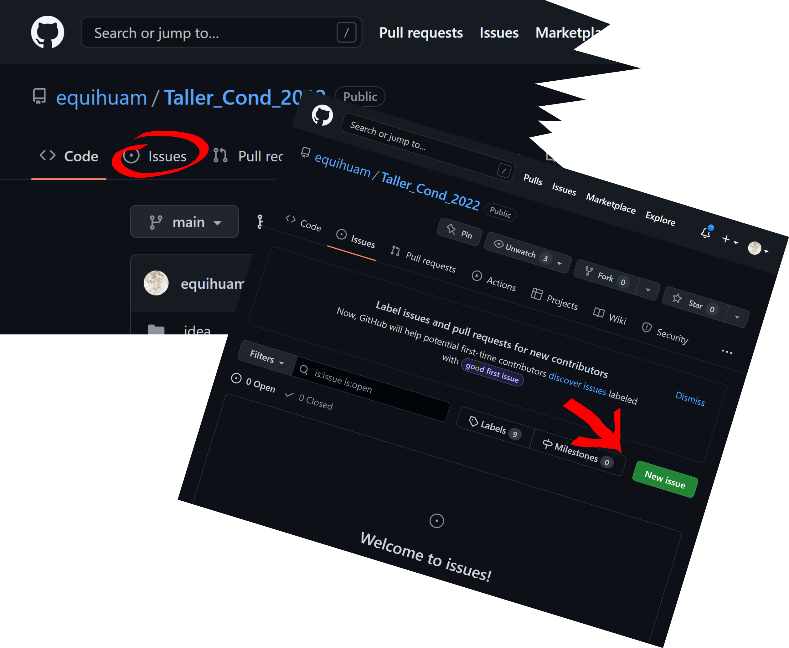

<style>
.table-hover > tbody > tr:hover { 
  background-color: #EAE677;
}
</style>


```{r setup, include=FALSE}
library(readxl)
library(kableExtra)


knitr::opts_chunk$set(echo = FALSE)
knitr::opts_knit$set(base.dir = normalizePath(tempdir(), winslash = '/'))
```

## Taller sobre Cuenta de Condición

Los días 29 y 30 de agosto así como el 1 de septiembre se desarrolla este taller con la participación de personal de INEGI y SEMARNAT. Los conductores del taller son:

* Octavio Pérez Maqueo
* Miguel Equihua Zamora
* Julián Equihua Benítez

## Agenda del taller

```{r}
agenda <- read_excel("../../figuras/Agenda.xlsx", skip = 1, range = "B1:H30")

names(agenda) <- c("tema", "tiempo", "hora_i", "hora_f", "expone", "objetivo", "temas")
temas <- agenda$tema[!grepl("Duración|Día", agenda$tema) & !is.na(agenda$tema)]
horas_i <- as.character(agenda$hora_i[!grepl("Duración|Día", agenda$tema) &
                                      !is.na(agenda$tema)], format = "%H:%M")
horas_f <- as.character(agenda$hora_f[!grepl("Duración|Día", agenda$tema) &
                                      !is.na(agenda$tema)], format = "%H:%M")
objetivos <- agenda$objetivo[!grepl("Duración|Día", agenda$tema) &
                                      !is.na(agenda$tema)]

horas_i[temas == "Inicio"] <- c("", "", "")
horas_f[temas == "Inicio"] <- c("", "", "")
temas[temas=="Inicio"] <- c("Día 1", "Día 2", "Día 3")

# Add indentations to the 2nd & 4th row

programa <- data.frame(Tema = temas, Inicia = horas_i, Termina =horas_f)

programa %>%
  kbl() %>%
  kable_minimal() %>%
  kable_paper("hover", full_width = F, ) %>%
  add_indent( c(2:8, 10:14, 16:19), level_of_indent = 1) %>%
  row_spec(c(1, 9, 15), bold = T, color = "gray50", background = "burlywood") %>%
  row_spec(c(2:8, 10:14, 16:19), bold = T, color = "gray70", background = "ivory") %>%
  row_spec(0, bold = T, color = "brown", font_size = 20)

```

### Preguntas y respuestas
Hemos preparado el taller casi por completo en la plataforma en el [repositorio Taller_cond_2022 en Github](https://github.com/equihuam/Taller_Cond_2022/commits/main). Proponemos dar seguimiento a dudas puntuales a través de la opción de [issues](https://github.com/equihuam/Taller_Cond_2022/issues). Es además un espacio de aprendizaje, pues las respuestas a las preguntas que se vayan formulando quedarán almacenadas aquí y podrán ser consultadas cuando sea necesario. Para hacer una consulta nueva simplemente habrá que oprimir el botón de **new issue** e ingresar la consulta en forma suficientemente detallada (quizás con algún ejemplo) y dar seguimiento a la discusión que la acompañará hasta que se declare resuelto el asunto. Las pantallas respectivas se ilustran a continuación.





### Consideraciones estratégicas

Para reflexionar sobre aspectos estratégicos de la gestión del sistema de cuentas ambientales basadas en ecosistemas (SEEA EA), proponemos utilizar este [pizarra virtual en Miro](https://miro.com/app/board/uXjVPf-z5Tg=/). Les solicitamos que vayan anotando ideas ahí, conforme les vayan surgiendo. Tenemos previsto tener una sesión de discusión sobre la perspectiva futura del sistema el Miércoles 1. Lo haremos con base en esta pizarra virtual.

<iframe width="768" height="432" src="https://miro.com/app/live-embed/uXjVPf-z5Tg=/?moveToViewport=-2488,-1273,4975,2544&embedId=473439136531" frameborder="0" scrolling="no" allowfullscreen></iframe>


