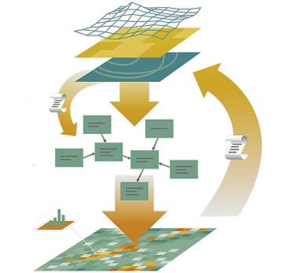

```{r setup, include=FALSE}
knitr::opts_chunk$set(echo = FALSE)
```


```{r, echo = FALSE, fig.align = 'center', out.width = '80%'}


```

```{r}
library(raster)

```

Aunque este proceso puede hacerse con la nueva biblioteca *terra*, en realidad hoy por hoy, la biblioteca *raster* es más eficiente y conveniente para hacer la tarea que nos proponemos resolver. Lo que haremos es leer un montón de archivos *raster* en formato *GeoTiff*. Generaremos unna colección congruente con ellos en términos de que comparten proyección y extensión y luego haremos una transformación de los objetos de datos para producir una tabla convencional de datos.

## Localización de los archivos

En la seción de ayer usamos la biblioteca *tools* y de ella la función `list_files_with_exts`. Volvamos a hacerlo.

```{r echo=TRUE}
library("tools")
mapas_dir <- "../../../data/indep_vars"

# Lista de los rasters considerados variables explicativas.
lst_gtif <- list_files_with_exts("../../../data/indep_vars",
                                  exts = "tif")
lst_gtif

```

Pueden ver que hemos encontrado 25 capas de información. Cada una de ellas aportará una columna de datos a nuestra tabla. Para hacer esto lo que haremos es:

1. Leer los GeoTiff uno a la vez y agregarlo a una colección **brick**
2. Convertir la colección de objectos raster a una colección de puntos *vectoriales.
3. Convertir los puntos en una tabla en la que cada capa aporta una columna.

Puede convenir tomarle el tiempo a este proceso, así que les mostraré como hacerlo. Simplemente lo que haré es tomar nota de la hora de arranque del proceso y luego al final el tiempo de salida. Calculo la diferencia entre estos dos valores y tengo una buena idea de cuanto tomo el proceso.

```{r echo=TRUE}
tiempo_inicio <- Sys.time()
datos_brk <- raster(lst_gtif[1]) # tengo que iniciar el ladrillo, así que lo hago aquí    
for (r in lst_gtif[2:length(lst_gtif)]) # como ya use este mapa, el ciclo empieza en el mapa 2
{
  datos_brk <- addLayer(datos_brk, raster(r))
}

names(datos_brk)
datos_tbl <- as.data.frame(rasterToPoints(datos_brk)) # aquí ocurre la magia imágen a tabla!!!
head(datos_tbl)
tiempo_fin = Sys.time()
tiempo_fin - tiempo_inicio

```


Ahora sólo resta guardar los datos en algun lugar de mi conveniencia. Lo haré en este caso con la biblioteca **data.table** que es super eficiente para datos grandes, así que conviene que la conozcan. Esta biblioteca contiene la función `fwrite` que es la que utilizaremos. Crearemos un archivo **csv** (valores-separados-por-comas). Anote las opciones que requiero para hacer el archivo **csv** como lo necesito. En **R** el símbolo "#" indica que lo que sigue la máquina no debe interpretarlo, así que puede usarse para añadir comentarios para el consumo humano.


```{r echo=TRUE}
library(data.table)
fwrite(datos_tbl, # datos obtenidos en el proceso anterior
          file = paste0(mapas_dir,"../../../data/indep_vars/datos_yuc_2018.csv"), # destino y nombre del archivo
                        sep = ",",           # La coma que separa los valores
                        quote = FALSE,       # No quiero que ponga los nombres entre comillas
                        na = "*",            # Netica utiliza * como indicador de dato faltante
                        row.names = FALSE,   # No quiero una primera columna de números "id"
                        showProgress = FALSE)# No necesito una barra de progreso

```


Con este proceso hemos preparado una tabla de datos adecuada para ser leída en NETICA y podemos continuar con el procedimiento de construcción de los datos que utilizaremos en la contabilidad. 


