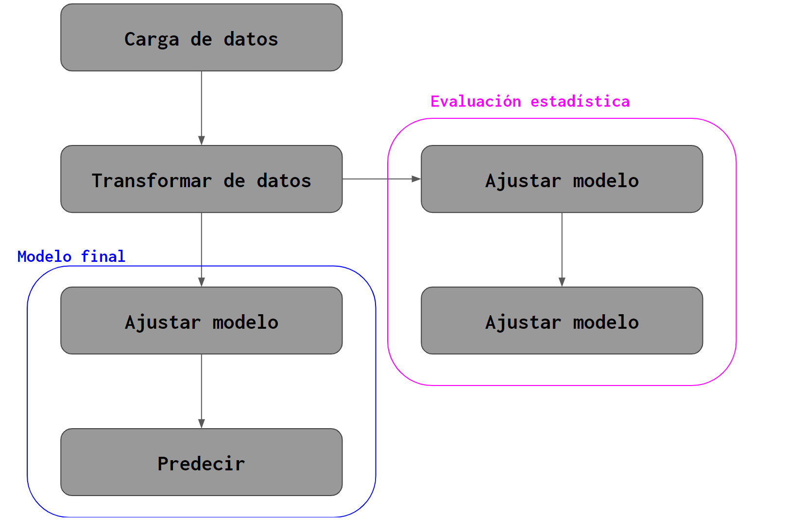
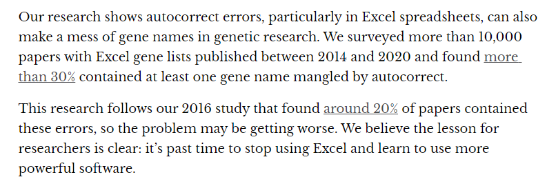

# Pipeline

## ¿Qué es un pipeline?

Es un conjunto de elementos de procesamiento que se ejecutan en serie. Esto es que la salida de uno de los elementos es la entrada de otro.

Veamos un esquema sencillo correspondiente a un pipeline para ajustar un modelo de IE.

```{r, echo = FALSE, fig.align = 'center', out.width = '100%'}


```

En las sesiones anteriores visto algunos de los pasos que llevaría a cabo un pipeline de este tipo.

Todo se ha ejecutado a mano pero se mostró: 

* Cómo <span style="color:red">cargar</span> el conjunto de rasters correspondientes a la variabel explicativa en memoria e introducirlos a un raster multi-banda.
* El raster multi-banda anterior se debe <span style="color:red">transformar</span> a una tabla de datos para poder llevar a cabo cualquier proceso de analítica.
* En el caso del proceso de validación estadística, la tabla se separa en múltiples conjuntos que iterativamente son utilizados para <span style="color:red">ajustar</span> modelos predictivos (redes bayesianas en nuestro caso).
* Cada modelo predictivo de los anteriores se utiliza para <span style="color:red">predecir</span>  sobre el conjunto de datos excluído de su proceso de ajuste.
* El modelo final se <span style="color:red">ajusta</span> sobre la tabla de datos completa. 
* Luego el modelo final se utiliza para <span style="color:red">predecir</span> y esta predicción se vuelve el mapa de integridad ecosistémica.

## ¿Por qué construir un pipeline?

* Control
* Reproducibilidad
* Eficiencia
* Escalabilidad

### Control

Un pipeline bien organizado hace que el proceso de modelado sea más flexible. En cierto sentido es como tener un buen diagrama de una máquina donde puedes experimentar con/manipular e incluso reemplazar partes.

Suena un poco evidente, pero si los procesos de <span style="color:red">carga</span> y <span style="color:red">transformación</span> de datos ya funcionan bien, pero el proceso de validación es muy lento, se pueden enfocar los esfuerzos en desarrollarlo de mejor manera. Se debe entender un pipeline justo como parte de una maquinaria, es algo que nos permite encadenar una seria de procesos para llegar a un objetivo u objetivos sin intervención humana. Esto nos lleva a nuestro siguiente punto.

### Reproducibilidad

```{r, echo = FALSE, fig.align = 'center', out.width = '100%'}

knitr::include_graphics("3_crisis.jpg")
```
[fuente](https://www.nature.com/articles/533452a)

No es un gran secreto que hay una crisis de [reproducibilidad](https://ropensci.org/blog/2014/06/09/reproducibility/) en la ciencia.

Hay muchas causas para tal crisis pero una de las más modernas es la incapacidad de replicar los resultados por cuestions de administración, procesamiento y análisis de datos. 

Lo primero que se viene a la mente es no tener acceso al software para replicar los resultados, o por usar software propietario y carecer de licencia o porque los autores no compartieron su código. Esto nos lleva a hacer un llamado a utilizar software de código abierto y siempre compartir el código con el que se llevó a cabo un proyecto. Por supuesto esto puede ser más o menos delicado por cuestiones de seguridad.

Lo segundo que viene a la mente es con qué herramientas se llevan a cabo los procesos. A pesar de vivie en la época del BIG DATA, si somos honestos, casi nadie lleva a cabo sus procesos analíticos con Big Data. La mayoría de los procesos analíticos se llevan a cabo sobre archivos de texto y en excel.

```{r, echo = FALSE, fig.align = 'center', out.width = '100%'}


```

[fuente](https://theconversation.com/excel-autocorrect-errors-still-plague-genetic-research-raising-concerns-over-scientific-rigour-166554)

A lo mejor es un poco injusto hacer un llamado total a dejar de usar Excel, por supuesto es una herramienta poderosa en sí misma y muy cómoda para llevar a cabo ciertas exploraciones de datos. Pero una vez que lo que se quiere hacer queda claro, definitivamente conviene automatizarlo con algún proceso en, por ejemplo R, y meterlo a un pipeline.

En el artículo de Nature antes citado comienza diciendo que más del 70% de los investigadores encuestados (~1500) fallaron al intentar replicar los experimentos de otro científico. Más del 50% fallaron al replicar sus propios experimentos.

Por supuesto esto está exacerbado en ciencia que depende de métodos empíricos pero la investigación basada en analítica está lejos de estar a salvo.

Si unos resultados analíticos se alcanzan utilizando un pipeline, hay una absoluta certeza de que los resultados son reproducibles. Esto es, con base en una misma entrada, lo que al final arroja un pipeline siempre será lo mismo.

# Eficiencia

```{r, echo = FALSE, fig.align = 'center', out.width = '100%'}


```


Por supuesto que un proceso automatizado de manejo de datos es más veloz que copiar y pegar celdas a mano en una hoja de cálculo excel. Como ya se mencionó, puede ser útil llevar a cabo procesos con datos en excel para entender cómo deben de ser y para validar ciertos pasos pero al final del día lo más limpio y rápido será replicar eso con un proceso automatizado.

# Escalabilidad

Con el advenimiento del Big Data, se desarrollan diversas herramientas para la administración, consulta y análisis de datos. Hardware y software. Una cosa que se vuelve muy importante es el uso de pipelines para siquiera poder procesar Big Data. Un pipeline no sólo deja controlar el proceso analítico en sí, si no la gestión de los recursos destinados a los procesos y análisis que se están ejecutando. El software para hacer piplines está pensado para poder controlar a qué lugar mandar un cierto proceso (por ejemplo un Nodo en un cluster de alto desempeño), determinar la memoria RAM necesaria para cada proceso y organizar todo de tal manera que ningún proceso comience si no se ha terminado uno anterior que es necesario. Todo bajo un constante monitoreo para poder revisar que las cosas van bien y que, de haber errores, estos se están documentando. Naturalmente hay pipelines enormes y pipelines chicas. Algo interesante también es que no se necesita un proyecto gigantesto para aprovechar una plétora de computadoras, poder ejecutar numerosos procesos simultáneamente cuando ya se tiene una pipeline definida es una opción, sin duda, útil.

¿Qué es un contenedor?

```{r, echo = FALSE, fig.align = 'center', out.width = '80%'}


```


Un contenedor es una unidad estándar de software que empaqueta código y todas sus dependencias para que una aplicación corra confiablemente sin importar en qué ambiente se esté ejecutando.

Hay varios contenedores, los más interesantes para nosotros son:

* [Docker](https://www.docker.com/), por su popularidad y flexibilidad
* [https://apptainer.org/](https://www.docker.com/), por estar especializado en procesos analíticos

Estos contenedores permiten generar paquetitos que sencillamente se pueden compartir, listos para usarse en otro ambiente. Para proyectos chicos, una pipeline completa puede vivir en un solo contenedor. Para proyectos muy grandes, módulos importantes de la pipeline pueden vivir en contenedores diferentes y por tanto deben ser orquestrados por software adicional.¡Hay opciones son muchísimas! 

# Software

Hay muchísimo software para hacer pipelines. Cada lenguaje de programación tiene varias opciones y hay varios orientados a infraestructura particular, por ejemplo, [Sagemaker](https://aws.amazon.com/sagemaker/pipelines/) es específicamente para llevar a cabo machine learning en amazon web services. 

En R, uno de los paquetes más populares para hacer pipelines es [Drake](https://books.ropensci.org/drake/).

```{r, echo = TRUE, fig.align = 'center'}

library(drake)
library(dplyr)
library(ggplot2)
library(tidyr)
library(terra)

# Establecer rutas a archivos importantes.
ruta_ie <- "../../data/ie/ie_yucatan_2018.tif"

# Cargar funciones auxiliares.
histograma_ie <- function(df_ie){
  ggplot(df_ie, aes(ie_yucatan_2018, fill = cut(ie_yucatan_2018,11))) +
    geom_histogram(show.legend = FALSE, bins = 101)+
    scale_fill_brewer(palette="RdYlGn", direction = -1)+
    xlab("Integridad ecosistémica") + 
    ylab("Cantidad de píxeles (250m)")
}

plan <- drake_plan(
    raw_data = rast(ruta_ie),
    
    data = rast_ie %>% as.data.frame(),
    
    histograma = histograma_ie(data),
    
    ggsave("../figuras/histograma_yucatan_ie.png")
)


plan

vis_drake_graph(plan)


```


