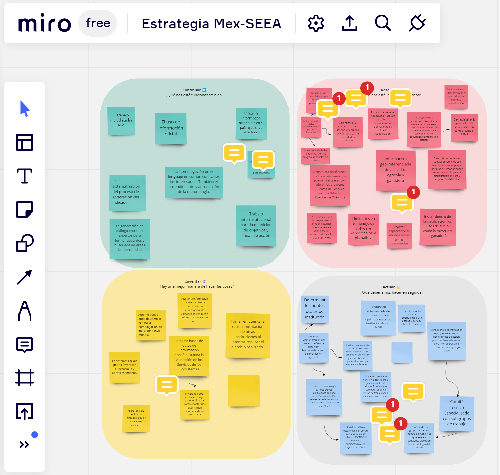

```{r setup, include=FALSE}
knitr::opts_chunk$set(echo = FALSE)

```

Como actividad final del taller se utilizó Miro para explorar acciones que se sugieren para mejorar la implementación, adopción y diseminación del uso de la cuenta de condicón con base en el enfoque de redes bayesianas. Podría ser de su interés saber que posible recuperar los datos de los tableros Miro directamente en R. Las [instrucciones para hacerlo están aquí](https://developers.miro.com/reference/api-reference).

A continuación se enlistan las contribuciones reunidas.

```{r, echo = FALSE, fig.align = 'center', out.width = '60%'}


```


```{r preliminares}
# Bibliotecas requeridas
library(httr)
library(jsonlite)
library(dotenv)
library(tidyverse)

# Siguiendo las instruccioes de https://developers.miro.com/reference/api-reference
lee_datos_miro <- function(componente, tipo_item = "", cursor = "")
{
  load_dot_env("../../../token_miro.env")
  
  # Preparación para acceder al tablero
  if (tipo_item == "")
  {
    queryString <- list(limit = "50") # 50 = máximo item página, más de esto usar "cursor"
    
  } else {
    queryString <- list(limit = "50",
                        type = tipo_item)
  }

  if (cursor != "")
  {
    queryString$cursor <- cursor
  }
  
  response <- VERB("GET", componente, 
                   add_headers("Authorization" = paste0("Bearer ", Sys.getenv("MIRO_TOKEN"))), 
                   query = queryString, content_type("application/octet-stream"), 
                   accept("application/json"))
  
  # Recupera los datos del tablero
   return (fromJSON(content(response, "text", encoding = "UTF-8")))
}


# datos generales del tablero
id_tablero <- "uXjVPf-z5Tg=" # tomado del vínculo que se usa para abrir el tablero de interes
tablero <-  paste0("https://api.miro.com/v2/boards/", id_tablero)

datos_tablero <- lee_datos_miro(tablero)

describe_miro <- data.frame(concepto = c("id tablero", "Nombre", "Descripción"), 
                            txt = c(datos_tablero$id, datos_tablero$name, datos_tablero$description))

# Items de tipo "shape" son el marco de fondo de los temas a tratar
items <-  paste0("https://api.miro.com/v2/boards/", id_tablero, "/items" )
items_shape <- lee_datos_miro(items, "shape")

cuadros <- data.frame(concepto = items_shape$data$data[, 1])
cuadros$concepto <- gsub("<.*?>|&#.*?;|\U23E9|\U26D4|\Ufe0f", "", cuadros$concepto)
cuadros$color[grepl("Actuar", cuadros)] <- "light_blue"
cuadros$color[grepl("Continuar", cuadros)] <- "cyan"
cuadros$color[grepl("Resolver", cuadros)] <- "red"
cuadros$color[grepl("Inventar", cuadros)] <- "yellow"

# Sticky_notes en el tablero, ideas aportadas por los participantes
notas <- paste0("https://api.miro.com/v2/boards/", id_tablero, "/items" )

items_sticky <- lee_datos_miro(notas, tipo_item = "sticky_note")

# Si aparece el concepto "cursor", restan items por recuperar
if (!is_empty(grep("cursor", names(items_sticky), value = TRUE)))
{
  items_sig <- lee_datos_miro(items, "sticky_note", cursor = items_sticky$cursor)
}


# Tabla de datos de notas ordenada por colores/concepto
datos_notas <- data.frame(color = items_sticky$data$style$fillColor,
                          idea = gsub("<.*?>|&#.*?;|\\xa0|\\ufe0f", "", 
                                      items_sticky$data$data$content),
                          id = items_sticky$data$modifiedBy$id)
if (!is_empty(items_sig))
{
  datos_sig <- data.frame(color = items_sig$data$style$fillColor,
                            idea = gsub("<.*?>|&#.*?;|\\xa0|\\ufe0f", "", 
                                        items_sig$data$data$content),
                            id = items_sig$data$modifiedBy$id)
  
  datos_notas <- rbind(datos_notas, datos_sig)
}

datos_notas <- datos_notas[order(datos_notas$color),]

describe_miro <- rbind(describe_miro, c("Núm. notas", items_sticky$total))

# Lista de participantes en el tablero
equipo <- paste0("https://api.miro.com/v2/boards/", id_tablero, "/members")
equipo_lst <- lee_datos_miro(equipo)
participantes <- data.frame(id = equipo_lst$data$id, nombre = equipo_lst$data$name)
datos_notas_1 <-  merge(datos_notas,  participantes, by = "id")

```


## Identificación y descripción del tablero


```{r}

# Utilizó el data.frame que se contruyó al inicio (chunk "preliminares")

knitr::kable(describe_miro)
```

los participantes en el ejercicio *Miro* fueron los que se registraron con los siguientes nombres.

```{r}
# Miembros tomados de data.frame que se contruyó al inicio (chunk "preliminares")
tabla <- data.frame(participantes$nombre[1:12], 
             participantes$nombre[13:length(participantes$nombre)])
knitr::kable(tabla, col.names = c("Participante","Participante"))
```


## Aspectos analizados

El análisis consideró cuatro aspectos.

```{r}

knitr::kable(sort(cuadros$concepto), col.names = "Aspecto")
```

## Continuar

En el ámbito de lo que se estima está funcionando bien se anotó lo siguiente.

```{r}

knitr::kable((datos_notas$idea[datos_notas$color == "cyan"]), col.names = "Idea")

```

## Resolver

Se identificaron algunos asuntos que se considera no están adecuadamente resueltos o aspectos que están obstaculizando actualmente el desarrollo y adopción del enfoque propuesto para la integración de la cuenta de condición.

```{r}

knitr::kable((datos_notas$idea[datos_notas$color == "red"]), col.names = "Idea")

```

## Innovar

Los participantes identificaron algunos elementos que consideran aportarían innovaciones valiosas para mejorar el desarrollo de la cuenta de condición o aspectos sobre los que se debería continuar trabajando para producir un mejor resultado.

```{r}

knitr::kable((datos_notas$idea[datos_notas$color == "yellow"]), col.names = "Idea")

```

## Actuar

Finalmente, se hicieron algunas sugerencias de acciones de puesta en práctica inmediata que se estima mejorarían ampliamente el desarrollo, implementación y adopción general de la cuenta de condición del Sistema de Contabilidad de los Ecosistemas.


```{r}

knitr::kable((datos_notas$idea[datos_notas$color == "light_blue"]), col.names = "Idea")

```
