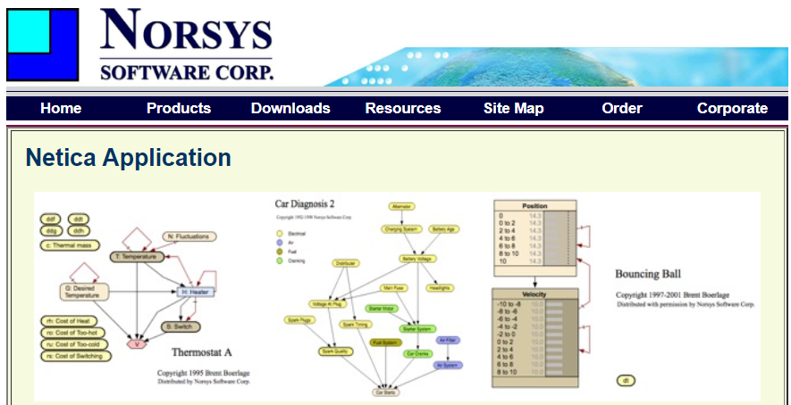

```{r setup, include=FALSE}
knitr::opts_chunk$set(echo = FALSE)
```


```{r, echo = FALSE, fig.align = 'center', out.width = "60%"}



```

Hemos recurrido a un  video para explicar con bastante detalle la forma como utilizamos Netica para construir y entrenar la red bayesiana que fue la base para producir las estimaciones del _índice de integridad ecosistémica_ (__IIE__). Estos valores fueron los datos con los que se generó la _cuenta de condición_ de los ecosistemas de México. Netica es un programa comercial muy eficiente para el diseño interactivo y entrenamiento de redes bayesianas. En el video se muestra como hacer los cálculos para el caso particular del estado de Yucatán. Lo proponemos sólo como una recurso demostrativo pues usa un conjunto relativamente pequeño de datos. Las mismas operaciones y lógica se aplicaron al caso general con el que obtuvimos los estimadores de todo el país. El objetivo que proponemos para esta participación es:

> El participante entiende los conceptos básicos de redes bayesianas y puede calcular el IIE utilizando un programa basado en este paradigma


<iframe width="969" height="545" src="https://www.youtube.com/embed/W5esQJeQ_oE" title="Red Bayesiana del Índice de Integridad Ecosistémica con Netica" frameborder="0" allow="accelerometer; autoplay; clipboard-write; encrypted-media; gyroscope; picture-in-picture; web-share" allowfullscreen></iframe>

